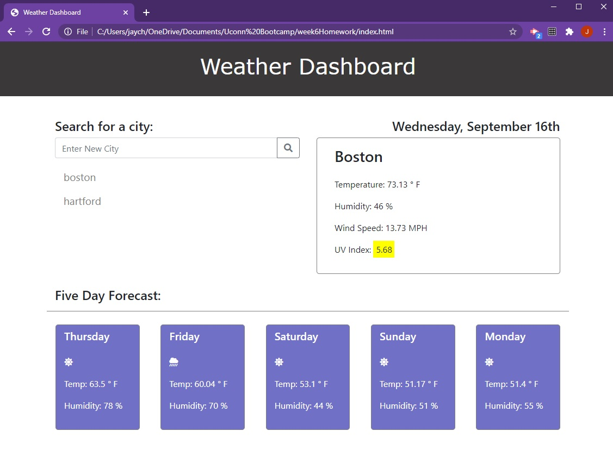

# Weather Dashboard

## About the Project

This project is a weather dashboard that uses the openweathermap API [openweathermap API](https://openweathermap.org/api). You can enter any city name and it will return today's weather plus the 5 day forecast. Local storage is used to store previous search results and when the page is refreshed or re-opened, it will display the weather and 5 day forecast for based on your last search. 

Here is a link to the deployed project: https://jaychapman.github.io/weatherDashboard/

---
## How I Completed the Project

All of the functionality is thanks to JavaScript. I used the openweather API to retrieve 5 day weather information and wrote the code to pull out the information I wanted and plug it in to the html file as necessary. In this project I created a very basic html file and then used the jQuery append method to fill in data to the appropiate divs. The webpage for this weather dashboard is alomost completely dynamically generated using JavaScript.

For the styling of the site I used the bootstrap grid system and some custom css to give it a unique look. I also incorperated [font awesome](https://fontawesome.com/) for the icons used to indicate if it is sunny, cloudy or raining in the 5 day forecast. I wanted to create a clean and modern looking application that was easy to use.

---
## What I Learned

This project was an excellent way to learn about APIs and how to incorperate them into functional applications. I also feel that my coding is getting much better and I am learning how to solve problems with my code without immediately searching google.

OVerall I'm really happy with how this project turned out. I am going to revisit this project at a later date and improve the layout for mobile devices.

Here's a link to the deployed application: https://jaychapman.github.io/weatherDashboard/

Thanks for reading this!

Jay
